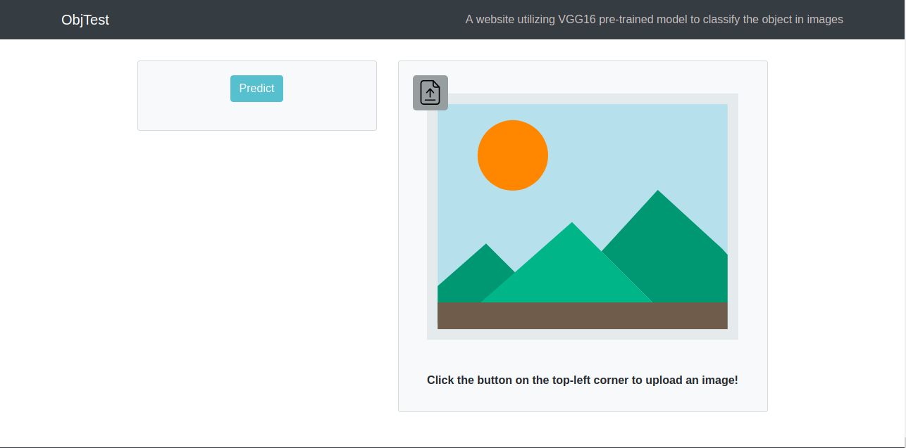
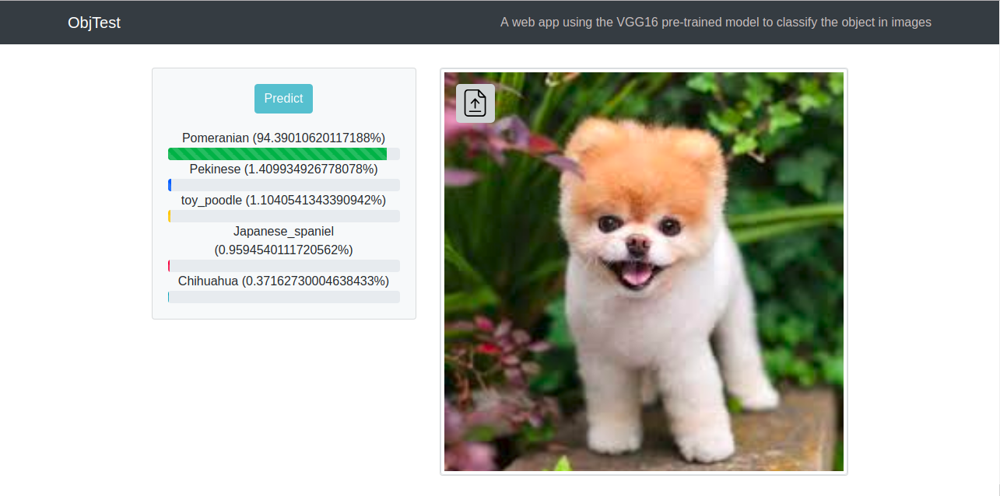

# ObjTest

**ObjTest** is a web app enable to predict the object in images. 

The app does not prioritize speed and optimization, but instead focuses more on the best web experience.

**Utilizing:** 
* [Flask](http://flask.pocoo.org/)
* [ReactJS](https://reactjs.org)
* [Bootstrap](https://getbootstrap.com/)
* [Tensorflow](https://tensorflow.org)
* [VGG16 pre-trained model with the ImageNet dataset](https://neurohive.io/en/popular-networks/vgg16/).

## Quick Overview






## How to run?
First, clone this repository:

```bash
git clone https://github.com/ngthanhvinh2000/ObjTest
cd ObjTest
```

### Run Flask back-end

From the root, open a terminal window and run the following commands:

```bash
cd backend
pip install -r requirements.txt
python3 server.py
```

The back-end server is hosted at: [localhost:5000](localhost:5000).

### Run React front-end

From the root, open another terminal window and run the following commands:

```bash
cd frontend
npm install
npm start
```

Access [localhost:3000](localhost:3000) to enjoy the React app!

